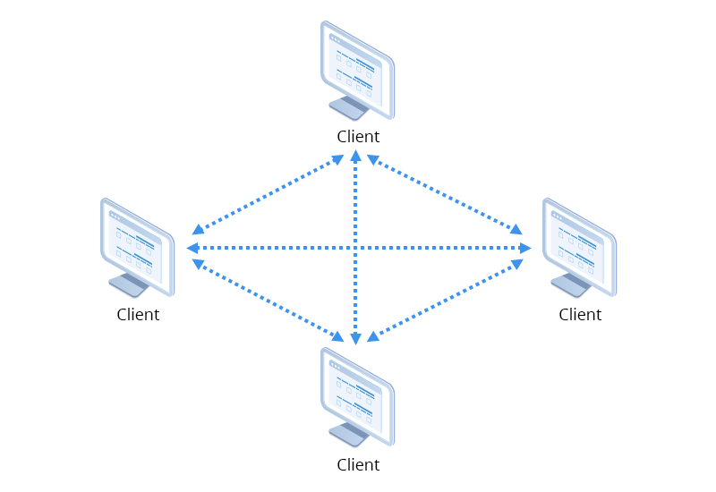
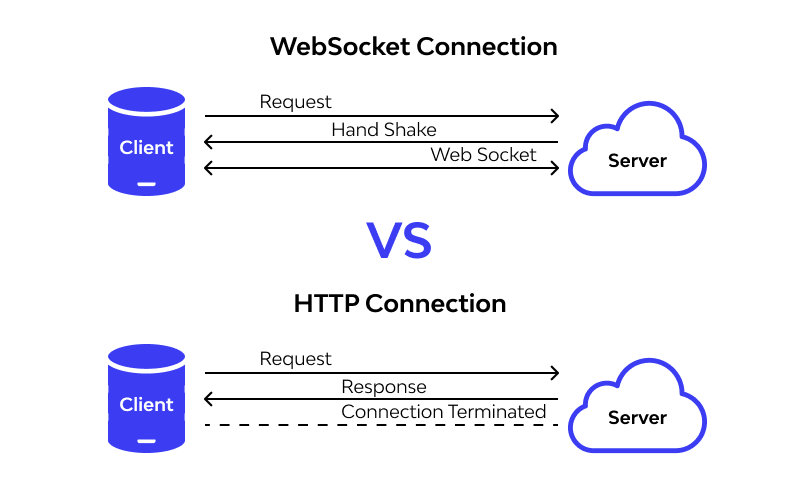

### OSI layer system 
We have OSI layer as a 7 Layer system 
Application Layer 
Presentation layer 
Session Layer 
Transport Layer 
Network Layer 
Data Link Layer 
Physical Layer 

#### Application Layer  
- > Peer to peer Protocols 
- > Client Server Protocol 

Peer To Peer Protocols      
WebRTC (UDP Protocol) (Video streaming , Audio Streaming)    

Client-Server Protocol     
FTP (1-control connection , 1 Data connection)    
SMTP(Simple Mail Transfer protocol) - sending the email (is used along with Imap or POP , IMAP -> receiving the mail   )     
Http (1 Connection )    
WEbSockets (Bidirectional Communication)  -> Client can talk to server and Server can talk to client
(for messaging applications)

Transport Layer 
- > TCP - Connection is maintained, ordering maintained, Handshake
- > UDP - L

We create small data packets anf give them sequences
