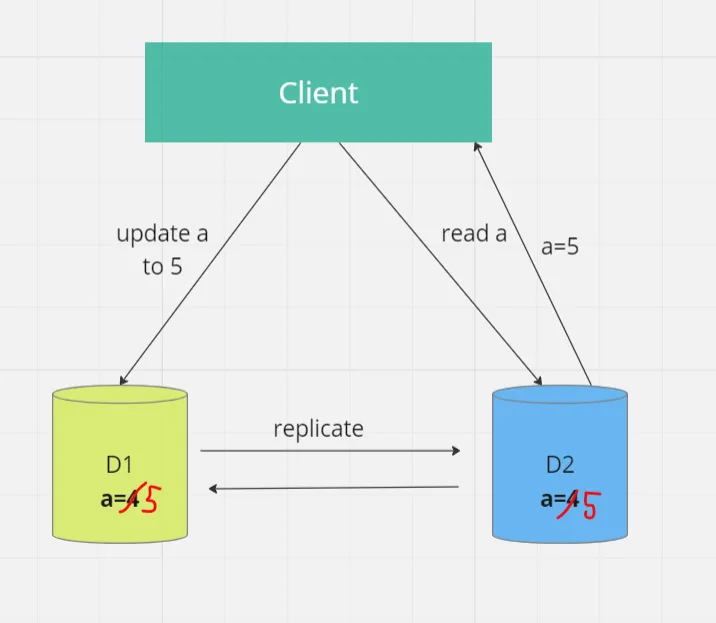
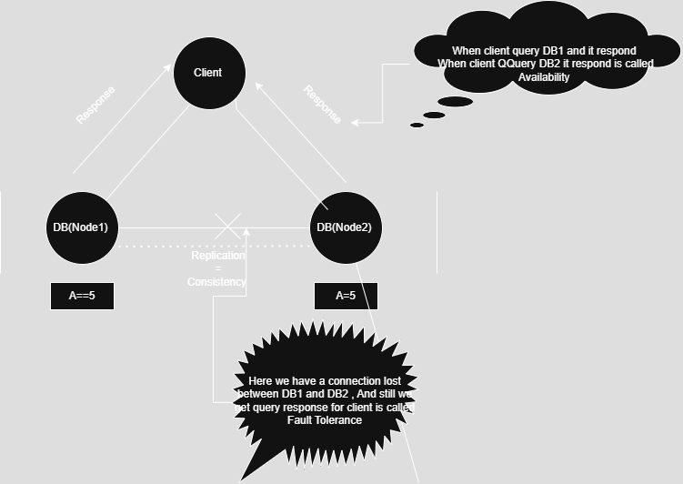

### CAP THEOREM 
- > C-> Consistency     - consistency means that all nodes or replicas in the system have the same data at the same time.               
- > A-> Availability    - all the nodes of data should respond , means every request should receive a response even in case of node failure.                
- > P-> Partition Tolerance   ->  Suppose somehow connection is lost between d1 and d2.  And still we are getting response is called tolerance to partition.
  > OR       The system continues to operate despite network failures.              

Desirable property of Distributed System with replicated(Copied) Data. 
Consistency -    
We can not achieve the all the variables in one system. We can achieve two at one time.    
CA -> Consistency & Availability     we have to stop the system to achieve it .                       
AP -> Availability & Partition Tolerance (Most Important one ** ) Here both the DB nodes cannot be updated with latest data.                             
CP -> Consistency & Partition Tolerance      Down one node                    

