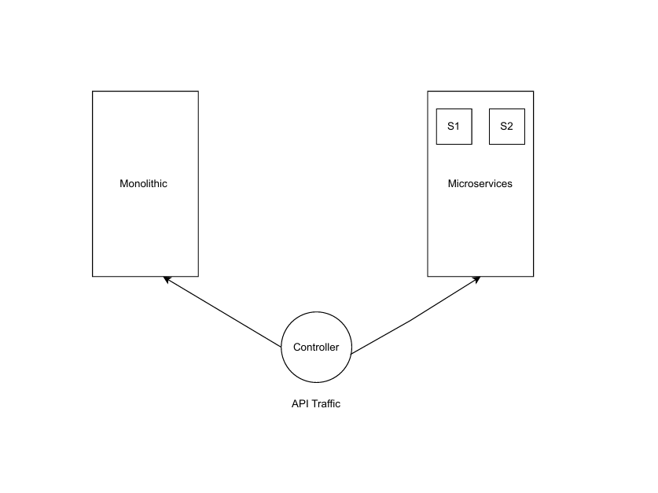
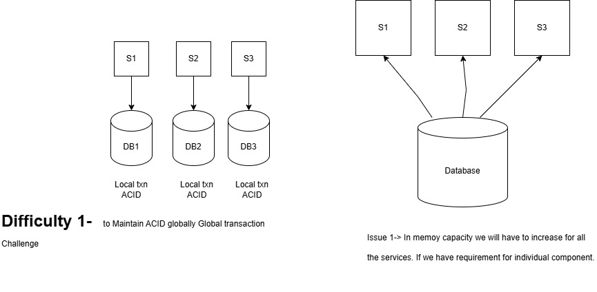
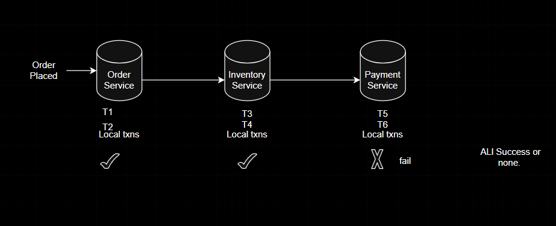
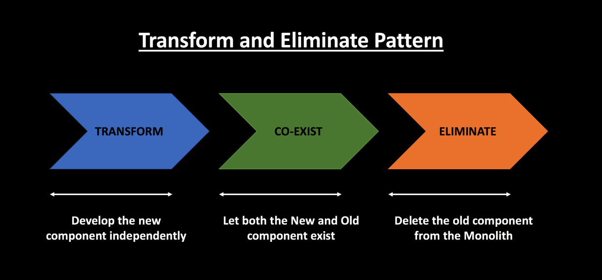

###  Monolithic Artitecture vs Microservices Artitecture 
Monolithic  - Overload IDE, Scaling is very hard [Product, Billing, Account,Payment]       
Microservices - All the disadvantages of monolithic are advantage of microservices. 

1) Loosely coupled Right (tick ) Less Dependent on any other Service. 

   -  Latency increases   
[MS2---------->MS1] Latency increases when microservices are not lossely coupled.      

Lossely coupled --> Scaling one service without impacting other service.    
2) Monitoring become difficult.    
3) Transaction Management   (Difficult)
Maintaining a legacy application is cumbersome and often leads to additional work because of multiple reasons -

- Lack of Unit Tests.      
- Violation of Single Responsibility Principle.       
- High Complexity leads to more time spent in maintenance activities.       
- Inability to scale individual components to meet increased demand.     
- Tight coupling between components makes it difficult to deploy regularly.     
- Technical Debt accumulated over time and makes future development difficult.    

### Moving from Monolithic Artitecture to Microservices Artitecture

### PHASES OF MICROSERVICES 
#### 1. Decomposition Pattern   
- > By Business Functionality / Capability 
- > By SubDomain 
  
##### (i) By Business functionality / Capability 
Challenge ->   Should have knowledge of functionality    
**Online Order Application**      
a) _Order Management_      
OrderID , Order Name, Location, Delivery , Agent assigned       
b) _Product Management_  Inventory Management        
c) _Account Management_  IsItemBuild, Amount TID, 
d) _Login_ 
e) _Billing_ 
f) _Payment_ 
##### (ii) By SubDomain (Domain Driven Design)            
Order Management                     -----> [     ]
                                     -----> [     ] 
                                     -----> [     ] 

Payment User1<----->User2    
a) forward Domain   
b) Backward Domain      

### Strangler Pattern [Refactoring to Microservices] 
If there is any issue comes in Microservice we can switch back to the traffic to monolithic. This flow can be controlled by controller

#### 2. Database Management in Microservices.
- > Database per service.       
- > Database shared.       
  

##### SAGA Pattern 
Sequence of Local Transactions 

Order will be places only when all events will success. otherwise it will fail. Either all will success or none.

Transform and Eliminate Pattern

SAGA  
- Choreography -- Each ms that is part of transaction publishes an event that is processed by next MS.  

- Orchestration -- A single orchestrator is responsible for managing the overall transaction status. 

#### 3. Communication 
- > API 
- > Events 

#### 4. Integration 
- > API Gateway 
