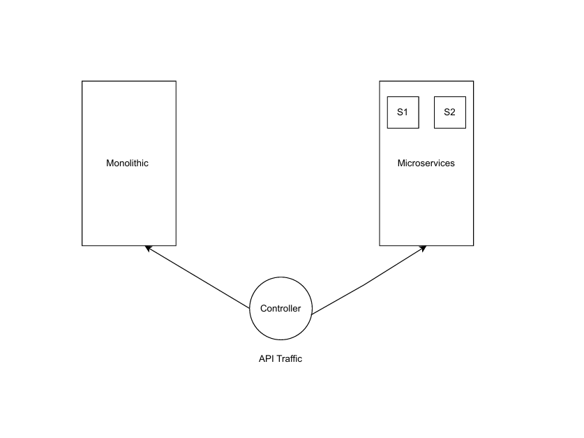
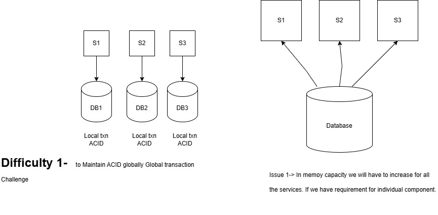
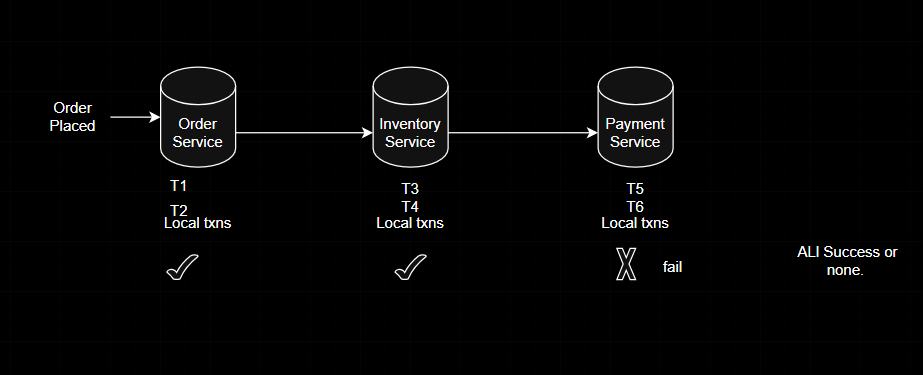
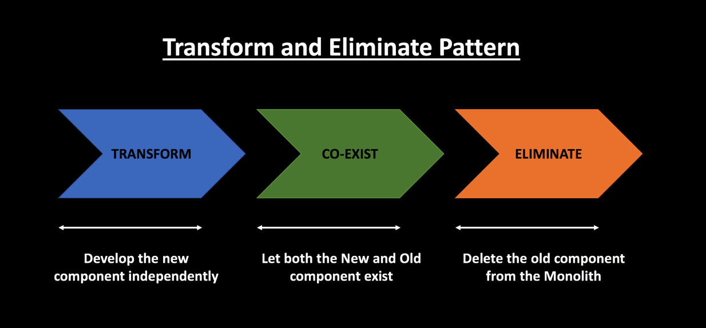
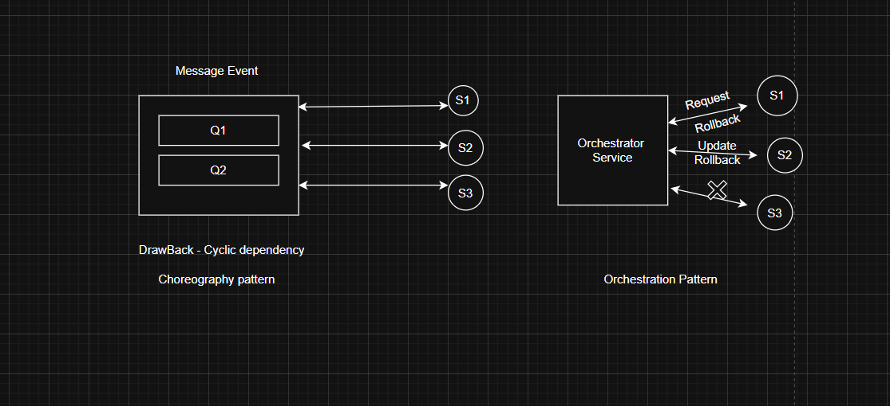

###  Monolithic Artitecture vs Microservices Artitecture 
Monolithic  - Overload IDE, Scaling is very hard [Product, Billing, Account,Payment]       
Microservices - All the disadvantages of monolithic are advantage of microservices. 

1) Loosely coupled Right (tick ) Less Dependent on any other Service. 

   -  Latency increases   
[MS2---------->MS1] Latency increases when microservices are not lossely coupled.      

Lossely coupled --> Scaling one service without impacting other service.    
2) Monitoring become difficult.    
3) Transaction Management   (Difficult)
Maintaining a legacy application is cumbersome and often leads to additional work because of multiple reasons -

- Lack of Unit Tests.      
- Violation of Single Responsibility Principle.       
- High Complexity leads to more time spent in maintenance activities.       
- Inability to scale individual components to meet increased demand.     
- Tight coupling between components makes it difficult to deploy regularly.     
- Technical Debt accumulated over time and makes future development difficult.    

### Moving from Monolithic Artitecture to Microservices Artitecture

### PHASES OF MICROSERVICES 
#### 1. Decomposition Pattern   
- > By Business Functionality / Capability 
- > By SubDomain 
  
##### (i) By Business functionality / Capability 
Challenge ->   Should have knowledge of functionality    
**Online Order Application**      
a) _Order Management_      
OrderID , Order Name, Location, Delivery , Agent assigned       
b) _Product Management_  Inventory Management        
c) _Account Management_  IsItemBuild, Amount TID, 
d) _Login_ 
e) _Billing_ 
f) _Payment_ 
##### (ii) By SubDomain (Domain Driven Design)            
Order Management                     -----> [     ]
                                     -----> [     ] 
                                     -----> [     ] 

Payment User1<----->User2    
a) forward Domain   
b) Backward Domain      

### Strangler Pattern [Refactoring to Microservices] 
If there is any issue comes in Microservice we can switch back to the traffic to monolithic. This flow can be controlled by controller

#### 2. Database Management in Microservices.
- > Database per service.       
- > Database shared.       
  

##### SAGA Pattern 
Sequence of Local Transactions 

Order will be places only when all events will success. otherwise it will fail. Either all will success or none.

Transform and Eliminate Pattern

SAGA Pattern: 
Each business transaction which spans multiple microservices are split into microservice specific local transactions, and they are executed in a sequence to complete the business workflow. It is called Saga. It can be implemented in 2 ways.

Choreography approach                     
Orchestration approach                   

- Choreography -- Each ms that is part of transaction publishes an event that is processed by next MS.  
[choreography](choreography.png)
This approach has many advantages.    
There is no service dependency. payment-service & inventory-services do not have to be up and running always.               
Loose coupling              
Horizontal scaling         
Fault tolerant         

The business workflow is implemented as shown here.

order-services receives a POST request for a new order                
It places an order request in the DB in the ORDER_CREATED state and raises an event                
payment-service listens to the event, confirms about the credit reservation              
inventory-service also listens to the order-event and conforms the inventory reservation            
order-service fulfills order or rejects the order based on the credit & inventory reservation status.           

- Orchestration -- A single orchestrator is responsible for managing the overall transaction status.

In this pattern, we will have an orchestrator, a separate service, which will be coordinating all the transactions among all the Microservices. If things are fine, it makes the order-request as complete, otherwise marks that as cancelled.

Each microservice which will be coordinated by orchestrator is expected to have at least 2 endpoints for each entity! One is deducting and other one is for resetting the transaction.

Let’s see how we could implement this. Our sample architecture will be more or less like this.!

-- > In this demo, communication between orchestrator and other services would be a simple HTTP in a non-blocking asynchronous way to make this stateless.               
-- > We can also use Kafka topics for this communication. For that we have to use scatter/gather pattern which is more of a stateful style.                   
[orchestration](Orchestration.png) 
#### 3. Communication 
- > API 
- > Events 

#### 4. Integration 
- > API Gateway 
